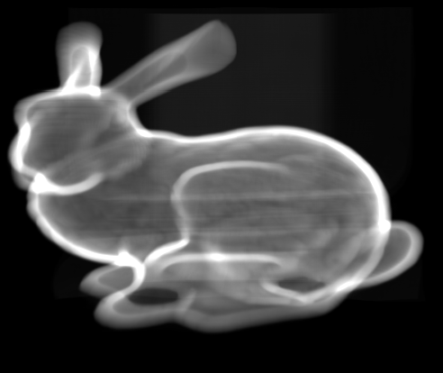
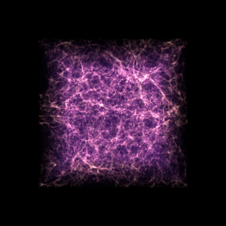

# Xenodon
Volumetric Ray Tracer written in C++17 using Vulkan.

Xenodon offers several different render output backends:
- X.org: Render to a common window, or to a set of windows
- Headless: Render to a file
- Direct: Render to monitors without a display server.

## Usage
See `xenodon help` for a detailed explanation on how to operate the program.

## Volumes
Xenodon can render 2 types of volumes:
- Uniform Grids. These can be passed to Xenodon in 3D stacked TIFF files. Each pixel of an image represents the emission color of a voxel, and each layer of the TIFF image should have the same dimensions.
- Sparse Voxel Octrees. These can be converted by Xenodon from 3D stacked TIFF files, see `xenodon help convert` for details on that operation.

## Traversal
5 Different traversal algorithms are implemented:
- DDA, implemented as a modified version of [A Fast Voxel Traversal Algorithm for Ray Tracing](https://www.researchgate.net/publication/2611491_A_Fast_Voxel_Traversal_Algorithm_for_Ray_Tracing) by Amanatides & woo.
- A naive sparse voxel octree traversal algorithm.
- A depth-first sparse voxel octree traversal algorithm.
- A modified version of [Efficient Sparse Voxel Octrees](https://research.nvidia.com/publication/efficient-sparse-voxel-octrees) by Laine and Kerras.
- A sparse voxel octree version of [Ray Tracing with Rope Trees](https://www.researchgate.net/publication/2691301_Ray_Tracing_with_Rope_Trees) by Havran, Bittner and Zara.

## Screenshots

A rendering of the CT-Scan of the stanford bunny. The original volume is 512 by 361 by 512 voxels.


Rendering of the TNG100-2 volume from the [TNG project](http://tng-project.org/). This volume is synthesized almost 700 million gas cells from snapshot 99, processed to a volume of 2048³.


Rendering of the TNG300-3 volume, also from the TNG project. 1024³ voxels constructed from over 224 million gas cells.

It should be noted that the latter two do not reach interactive framerates. Tests results from a Nvidia Titan X (pascal) 12 GB reach about 20 FPS on the DDA algorithm.

## Compiling
Several dependencies are automatically downloaded and compiled, however, the X.org and Direct render output backends in particular require some additional system libraries:
- X.org requires xcb, xcb-keysyms and xcb-xkb
- Direct depends on linux for getting input events.

For this reason, the X.org and Direct backends can be disabled at compile time by passing some flags to meson. To disable X.org, pass -Dpresent-xorg=disabled, and to disable Direct, pass -Dpresent-direct=disabled.

Additional dependencies required are Vulkan development files and libraries (including Vulkan-Hpp), and libtiff4. The former can for example be downloaded from [LunarG](https://www.lunarg.com/).

To compile the project, please run
```
$ mkdir build
$ cd build
$ meson ..
$ ninja
```

## Creating volumes
The volumes tested with are created with the utility scripts make-tng-volume.py and make-bunny-volume located in tools/. See the comments in those files for further details.
